<table>
  <tr>
    <td width="280" valign="top">
      <a href="https://github.com/whxtelxs">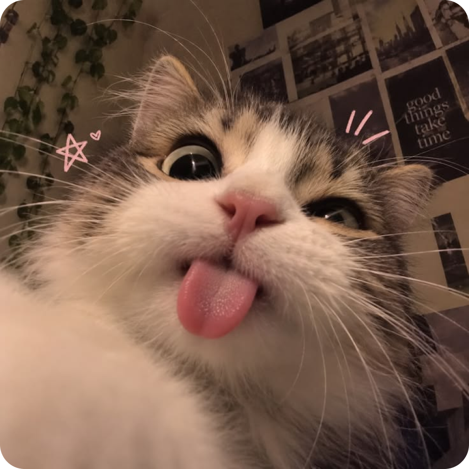</a>
      <h3>
        Евгений
        <a href="https://time.is/GMT+10">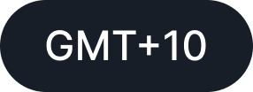</a>
      </h3>
      <a href="https://github.com/whxtelxs">@whxtelxs</a>
    </td>
    <td valign="top">
      <a href="https://github.com/whxtelxs">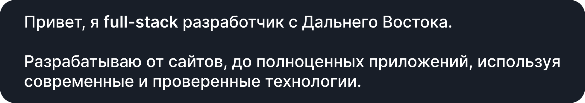</a>
      

        <a href="#stack">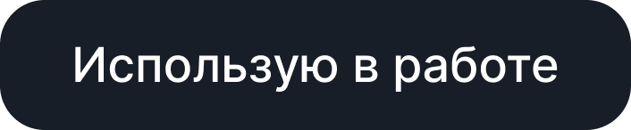</a>
      

      

        <a href="https://www.typescriptlang.org/">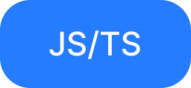</a>&nbsp;
        &nbsp;
        &nbsp;
        &nbsp;
        <a href="https://learn.microsoft.com/dotnet/csharp/">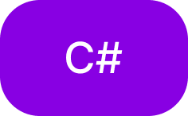</a>
      

      

        <a href="https://react.dev/">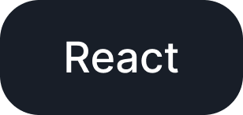</a>&nbsp;
        <a href="https://preactjs.com/">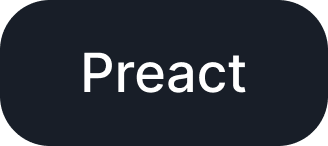</a>&nbsp;
        <a href="https://vuejs.org/">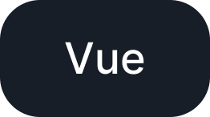</a>&nbsp;
        <a href="https://nuxt.com/">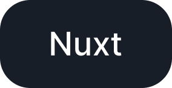</a>&nbsp;
        <a href="https://nextjs.org/">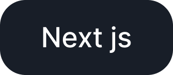</a>&nbsp;
        <a href="https://github.com/elsa-workflows/elsa-core">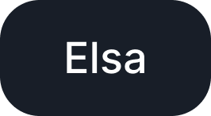</a>
      

    </td>
  </tr>
</table>

  <a href="#tracks">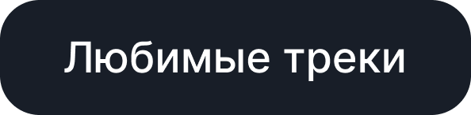</a>
    
  <table>
    <tr>
      <td>
        <a href="https://music.yandex.ru/search?text=%D0%9D%D0%BE%D1%87%D1%8C%20KSB%20muzic">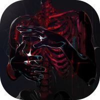</a>
      </td>
      <td>
        <a href="https://music.yandex.ru/search?text=%D0%9D%D0%BE%D1%87%D1%8C%20KSB%20muzic"><b>Ночь</b></a> 
        KSB&nbsp;muzic
      </td>
      <td>
        <a href="https://music.yandex.ru/search?text=%D0%9E%D1%82%D0%BA%D1%80%D1%8B%D0%B2%D0%B0%D0%B9%20YOUNG%20LARI%20%D0%9D%D0%AE%D0%94%D0%A1%20%D0%91%D0%9E%D0%99">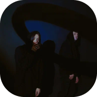</a>
      </td>
      <td>
        <a href="https://music.yandex.ru/search?text=%D0%9E%D1%82%D0%BA%D1%80%D1%8B%D0%B2%D0%B0%D0%B9%20YOUNG%20LARI%20%D0%9D%D0%AE%D0%94%D0%A1%20%D0%91%D0%9E%D0%99"><b>Открывай</b></a> 
        YOUNG&nbsp;LARI,&nbsp;НЮДС&nbsp;БОЙ
      </td>
      <td>
        <a href="https://music.yandex.ru/search?text=%D0%AF%20%D0%B2%D1%81%D0%B5%20%D0%B5%D1%89%D0%B5%20%D0%BF%D1%8B%D1%82%D0%B0%D1%8E%D1%81%D1%8C%20Myqeed">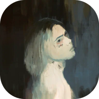</a>
      </td>
      <td>
        <a href="https://music.yandex.ru/search?text=%D0%AF%20%D0%B2%D1%81%D0%B5%20%D0%B5%D1%89%D0%B5%20%D0%BF%D1%8B%D1%82%D0%B0%D1%8E%D1%81%D1%8C%20Myqeed"><b>Я&nbsp;все&nbsp;еще&nbsp;пытаюсь</b></a> 
        Myqeed
      </td>
    </tr>
  </table>

